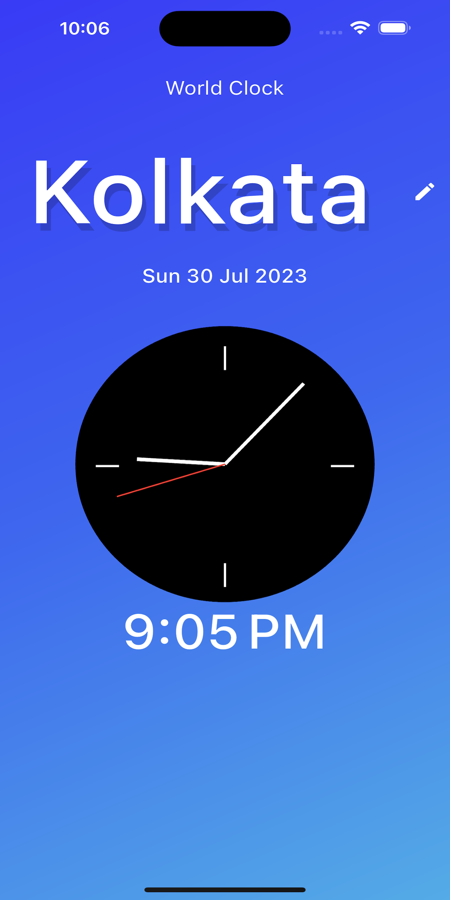
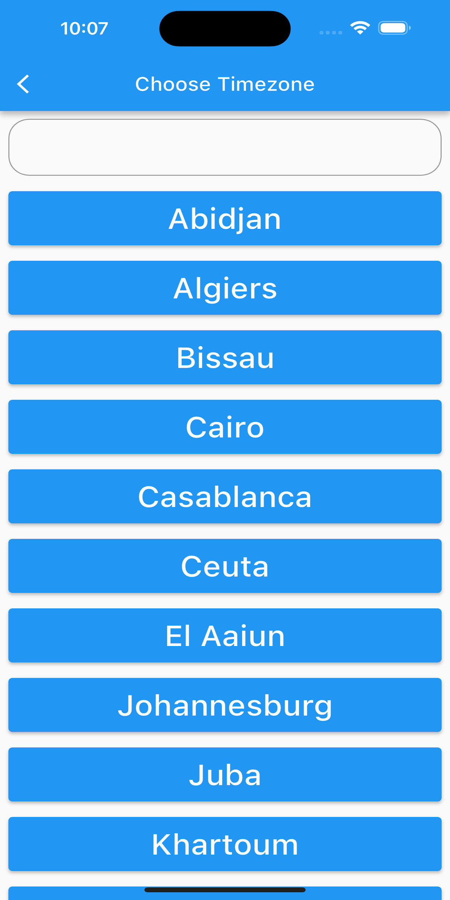
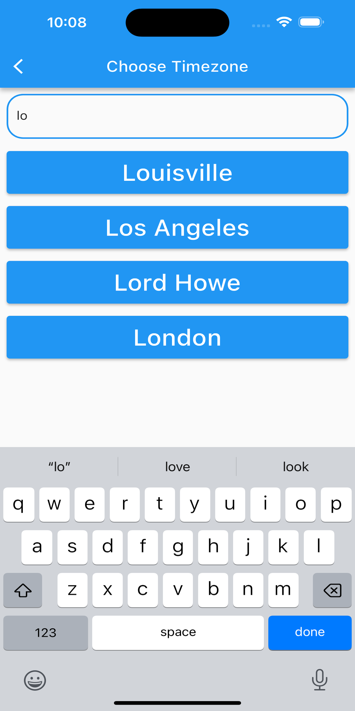

# World Time App

A Flutter application that displays the current time for different cities around the world.

## Features

- View current time for multiple cities.
- Search for cities to add to your watchlist.
- Simple and intuitive user interface.

## Installation

1. Make sure you have Flutter installed. If not, follow the official installation guide: [Flutter Installation Guide](https://flutter.dev/docs/get-started/install)
2. Clone this repository: `git clone https://github.com/your-username/world-time-app.git`
3. Navigate to the project directory: `cd world-time-app`
4. Install dependencies: `flutter pub get`
5. Run the app: `flutter run`

## Usage

1. Open the app.
2. The app will display the current time for a default city, i.e. Kolkata.
3. To select any otheer city more cities:
   - Tap the pencil icon.
   - Search for the desired city and select it.
   - The city's current time will be displayed.

## Screenshots

## Contributing

Contributions are welcome! If you find any issues or want to enhance the app, feel free to submit a pull request.

1. Fork the repository.
2. Create a new branch: `git checkout -b feature-new-feature`
3. Make your changes and commit them: `git commit -m 'Add some feature'`
4. Push to the branch: `git push origin feature-new-feature`
5. Open a pull request.

## License

This project is licensed under the [MIT License](LICENSE).

---
